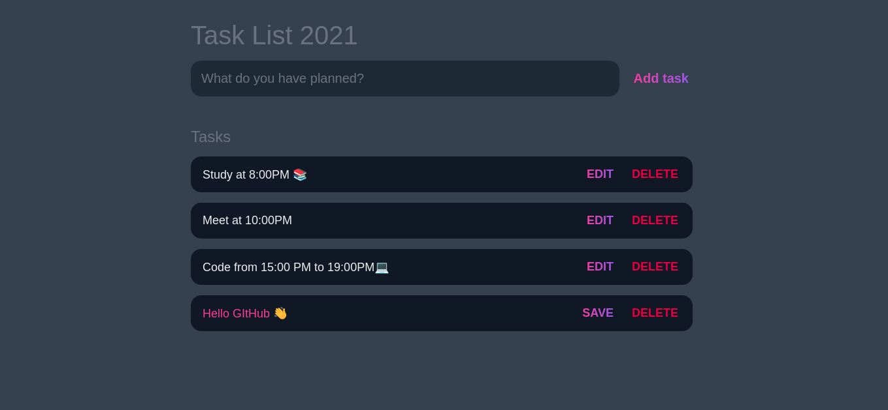

## This site was built with:

    

### A simple task list to organize your day. You can add, edit and delete tasks.

 
 
## Getting Started

1. Download the repository files from the download section or clone this project:
https://github.com/Agslz/task-list
2. Import it in VScode or any other text editor.
3. Have fun 🚀.

